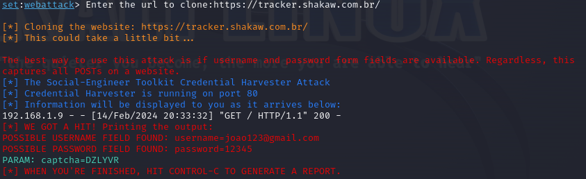

# Phishing para captura de senhas do Facebook

### Ferramentas

- Kali Linux
- setoolkit

### Configurando o Phishing no Kali Linux

- Acesso root: ``` sudo su ```
- Iniciando o setoolkit: ``` setoolkit ```
- Tipo de ataque: ``` 1) Social-Engineering Attacks ```
- Vetor de ataque: ``` 2) Website Attack Vectors ```
- Método de ataque: ``` 3) Credential Harvester Attack Method ```
- Método de ataque: ``` 2) Site Cloner ```
- Endereço IP da máquina: ``` Default (blank) ```
- URL para clone: ``` https://tracker.shakaw.com.br ```

### Resutados


